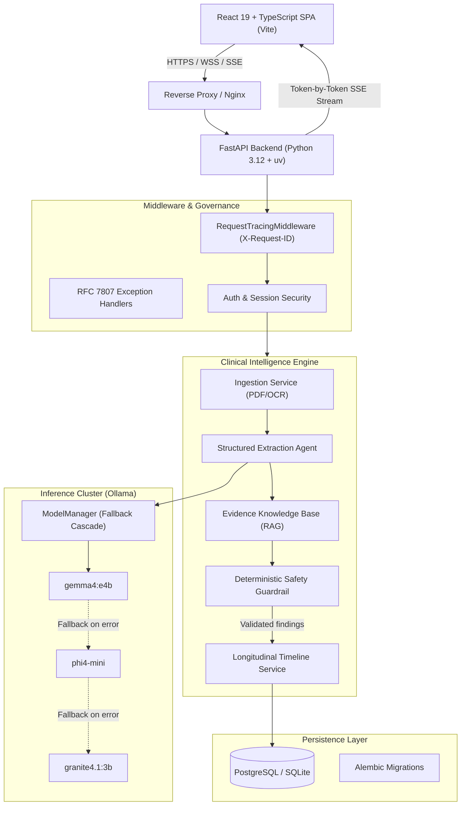

# BetterLife - Architecture & System Design

## 1. System Overview

BetterLife is an AI-powered Clinical Evidence Intelligence platform designed to parse, analyze, and longitudinally track medical laboratory and blood test reports. It operates with a **zero-cloud AI inference dependency**, routing all inference through a self-hosted Ollama server with automatic hierarchical model fallback and deterministic safety validation.



---

## 2. Backend Architecture (Layered Design)

The backend follows a strict layered architecture:

```
backend/
├── app/
│   ├── api/          # HTTP routers (thin controllers, OpenAPI contracts)
│   │   ├── chat.py
│   │   ├── clinical_patients.py
│   │   ├── clinical_documents.py
│   │   └── ...
│   ├── core/         # Cross-cutting foundational infrastructure
│   │   ├── config.py       # pydantic-settings typed validation
│   │   ├── errors.py       # RFC 7807 standard error handlers
│   │   ├── logging.py      # Structured JSON logging
│   │   └── middleware.py   # Request ID and latency telemetry
│   ├── services/     # Core business logic & state orchestration
│   │   ├── orchestrator_service.py
│   │   ├── safety_service.py
│   │   ├── timeline_service.py
│   │   └── knowledge_base_service.py
│   ├── agents/       # AI abstractions & model client
│   │   ├── model_manager.py
│   │   ├── chat_agent.py
│   │   └── extraction_agent.py
│   ├── schemas/      # Strongly typed Pydantic models
│   ├── db/           # SQLAlchemy models & Alembic migrations
│   └── main.py       # FastAPI application entrypoint
```

### Key Principles:
1. **Thin Routers**: Routers only deserialize inputs, invoke services/agents, and serialize output schemas.
2. **Deterministic Safety Filter**: Raw LLM output is parsed against Pydantic schemas and evaluated by `SafetyService` before ever reaching the client. Any prescription attempts or definitive diagnosis claims are blocked and flagged for human review.
3. **Structured Telemetry**: Every request receives an `X-Request-ID` and is timed via `RequestTracingMiddleware`, logging execution times in machine-readable JSON.

---

## 3. Frontend Architecture (Feature-Sliced React)

The frontend is built with React 19, TypeScript in `strict` mode, and Tailwind CSS, organized by functional domain features:

```
frontend/src/
├── app/              # Application root, ErrorBoundary, TanStack Query providers
├── features/         # Domain-driven feature slices
│   ├── auth/         # Context, modals, signin/signup flows
│   ├── chat/         # Streaming SSE conversational assistant
│   ├── clinical/     # Longitudinal charts, OCR viewer, RAG evidence explorer
│   └── sessions/     # Session manager, sidebar history
├── components/       # Shared reusable UI components (e.g. Navbar)
├── lib/              # Typed API client, environment validation
├── test/             # Vitest & React Testing Library suites
└── main.tsx          # Application bootloader
```

### Guarantees:
- **Streaming UX**: Token-by-token server-sent event (SSE) streaming with immediate AbortController cancellation.
- **Type Safety**: Unified types shared across API clients and components without `any` overrides.
- **Zero Raw Fetch**: All HTTP and SSE requests route through `@/lib/api/client` with standardized error wrapping.

---

## 4. Evaluation and Reliability

The system includes a dedicated offline benchmark test suite (`tests/integration/test_clinical_evaluation.py`) executing against `SYNTHETIC_EVALUATION_DATASET` to ensure:
- Field-level precision $\ge 85\%$
- Field-level recall $\ge 85\%$
- Longitudinal timeline trend detection accuracy $= 100\%$
- Prescriptive & diagnostic hallucination block rate $= 100\%$
- Offline execution resilience with mocked LLM fallbacks
